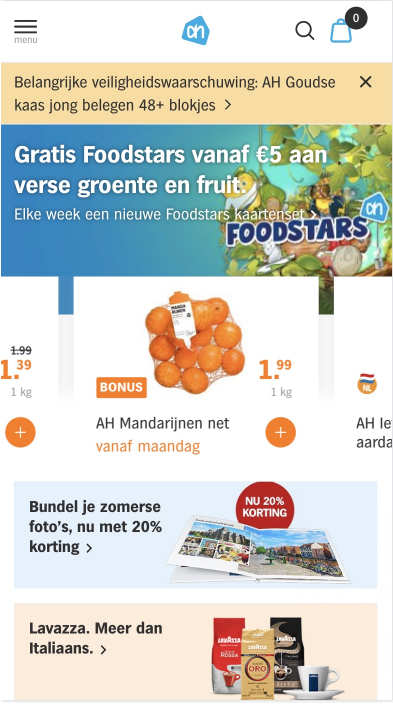
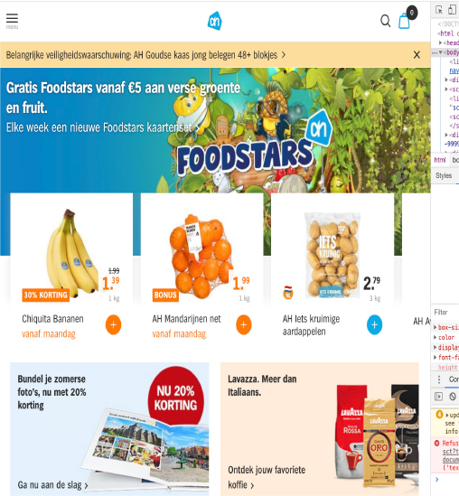
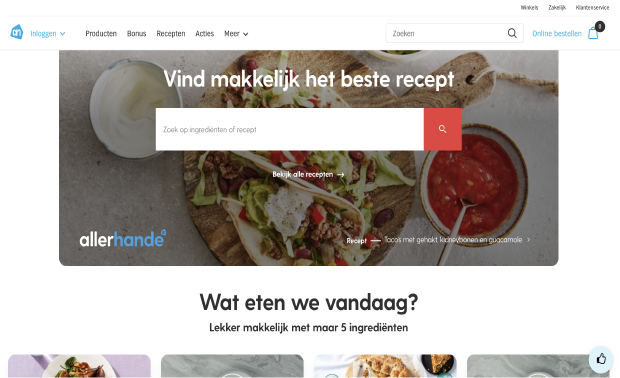
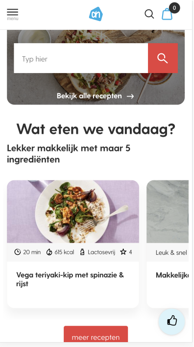
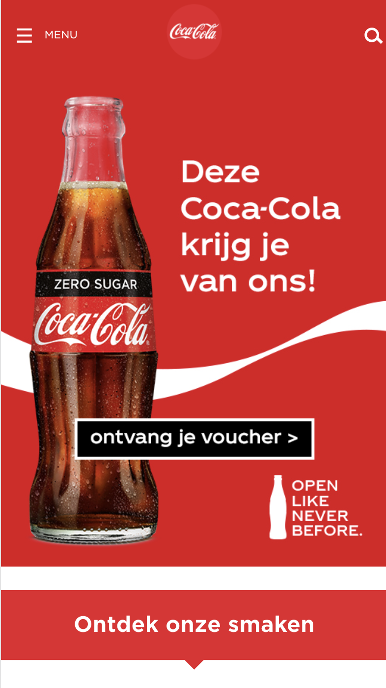
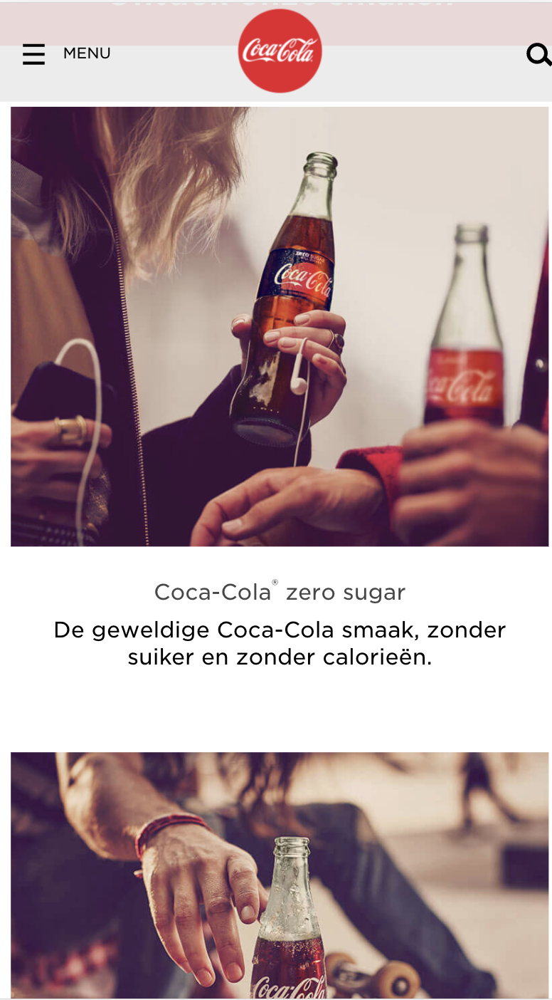
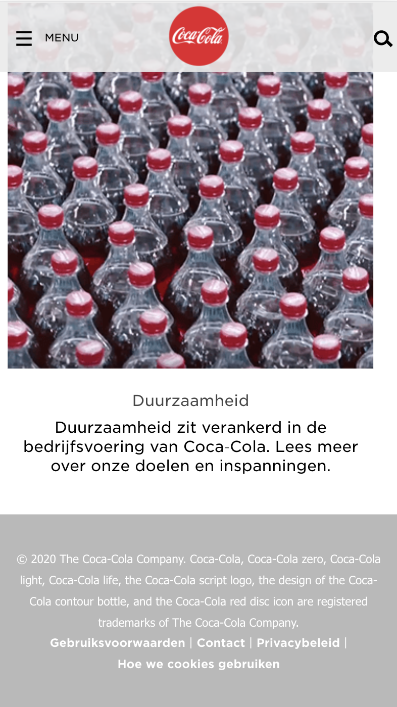
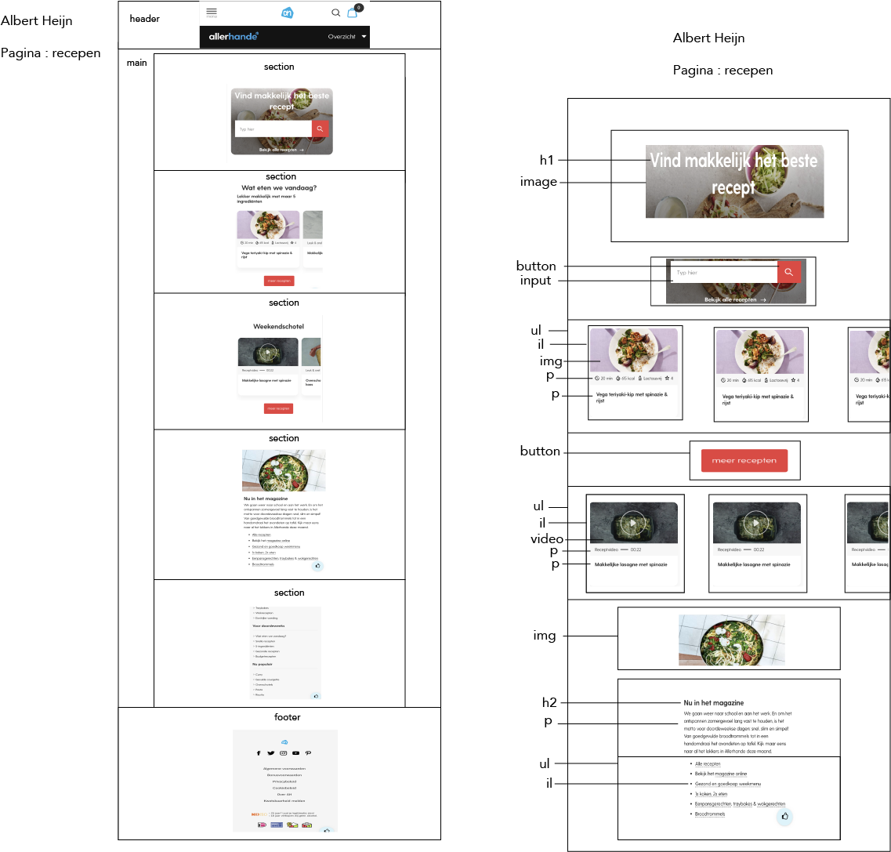

# Procesverslag
**Auteur:** -jouw naam-

Markdown cheat cheet: [Hulp bij het schrijven van Markdown](https://github.com/adam-p/markdown-here/wiki/Markdown-Cheatsheet). Nb. de standaardstructuur en de spartaanse opmaak zijn helemaal prima. Het gaat om de inhoud van je procesverslag. Besteedt de tijd voor pracht en praal aan je website.

## Bronnenlijst
1. -bron 1-
2. -bron 2-
3. -...-

## Eindgesprek (week 7/8)

-dit ging goed & dit was lastig-

**Screenshot(s):**

-screenshot(s) van je eindresultaat-

## Voortgang 3 (week 6)

-same as voortgang 1-

## Voortgang 2 (week 5)

-same as voortgang 1-

## Voortgang 1 (week 3)

### Stand van zaken

-dit ging goed & dit was lastig-

**Screenshot(s):**

-screenshot(s) van hoe ver je bent-

### Agenda voor meeting

-samen met je groepje opstellen-

### Verslag van meeting

-na afloop snel uitkomsten vastleggen-

## Intake (week 1)

**Je startniveau:** -kies uit zwart, rood óf blauw-

Blauw / rood. Ik vind coderen interessant en daarom heb ik ook voor rood gekozen, ik heb er wel moeite me en ik zie mezelf dit niet verder doen, maar zodra ik het meer begrijp vind ik het ook leuk om te doen en wil ik er ook meer tijd in steken. 

**Je focus:** -kies uit responsive óf surface plane-

Responsive. 

**Je opdracht:** -link naar de website die je gaat namaken óf de naam van je eigen ontwerp-

https://www.ah.nl/

of

https://www.cocacola.nl/nl/home/

**Screenshot(s):**

 

coca cola

**Breakdown-schets(en):**

van Albert Heijn 

